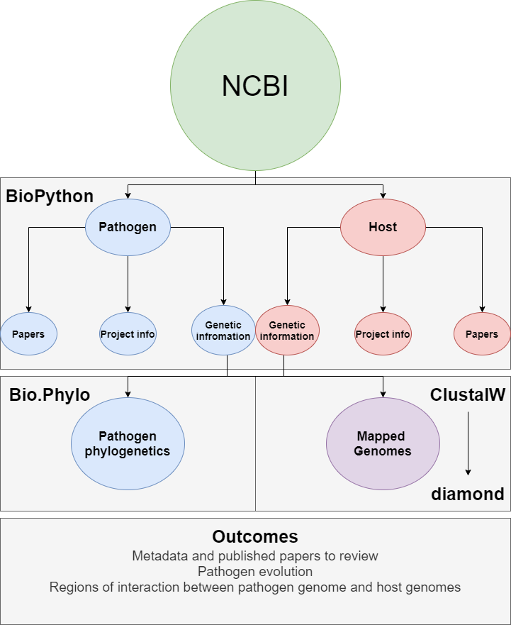

# Host Pathogen NCBI mining, phylogeny, and alignment

This project explores host pathogen genomic interactions. The pipeline largely depends on Biopython^1^ to mine the NCBI database for identified host and pathogen papers, project info, and gentic information. The identify.sh will store the identifed projects metadata and associated publications for review while also storing gentic information that it identifies for the host and pathogen given. Using a Biopython module Bio.Phylo^2^, the program will align pathogen genetic information to create a phylogenetic tree showing the diversity of the pathogens. The host and pathogen genetic information will then be aligned with ClustalW or MUSCLE to find pathogen artifacts within the host DNA. After alignment the identified regions will be annotated with BLAST, a proteins alignment program against a NCBI database. A genome diagram will be used to show regions of overlap using the module GenomeDiagram^3^

For this project there are four primary goals

1) Create script that can handle pathogen and host argument and search NCBI database using entrez
2) Parse entrez results into full record, accession numbers, and pubmed articles
3) Align pathogen nuccore sequences with clustalW and read .dnd file with Bio.phylo to create phylogenetic tree
4) Align host and pathogen nuccore sequences with ClustalW, extract regions, and identify with BLAST
5) Create Genome Diagram with subset identifying the gene and how they align

\left

**Citations**

[1] Peter J. A. Cock, Tiago Antao, Jeffrey T. Chang, Brad A. Chapman, Cymon J. Cox, Andrew Dalke, Iddo Friedberg, Thomas Hamelryck, Frank Kauff, Bartek Wilczynski, Michiel J. L. de Hoon: “Biopython: freely available Python tools for computational molecular biology and bioinformatics”. Bioinformatics 25 (11), 1422–1423 (2009). https://doi.org/10.1093/bioinformatics/btp163

[2] Eric Talevich, Brandon M. Invergo, Peter J.A. Cock, Brad A. Chapman: “Bio.Phylo: A unified toolkit for processing, analyzing and visualizing phylogenetic trees in Biopython”. BMC Bioinformatics 13: 209 (2012). https://doi.org/10.1186/1471-2105-13-209

[3] Leighton Pritchard, Jennifer A. White, Paul R.J. Birch, Ian K. Toth: “GenomeDiagram: a python package for the visualization of large-scale genomic data”. Bioinformatics 22 (5): 616–617 (2006). https://doi.org/10.1093/bioinformatics/btk021

\left